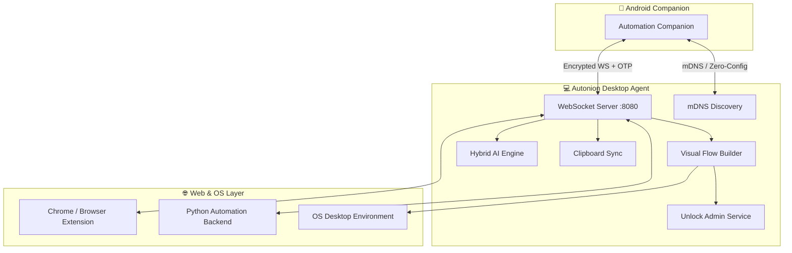

# Autonion Agent (Desktop Agent)

The **Autonion Agent** is a Flutter-based desktop application that serves as the central orchestration hub between your desktop operating system (Windows, macOS, Linux), browser environments, and the Android **Automation Companion** app. It provides zero-configuration local networking, secure device pairing, visual automation workflows, bi-directional clipboard sync, and hybrid AI-powered task execution.

---

## 🌟 Major Upgrades & New Features

### 1. 🔄 Visual Flow Builder & Automation Engine
A full-fledged, node-based visual workflow builder that lets you create, customize, and execute multi-step desktop automation flows without writing code:
* **Visual Node Canvas:** Chain together actions like mouse clicks, keyboard keystrokes, application launches, text input, delays, and conditionals.
* **Smart Flow Execution:** Execute complex automations locally on the desktop or trigger them remotely from your Android phone.
* **Flow Management:** Save, organize, export, and import automation presets with execution history and detailed logs.

### 2. 🔐 OTP-Based Secure Device Pairing
Enhanced security layer preventing unauthorized devices on the local network from sending commands:
* **6-Digit One-Time PIN (OTP):** When pairing your Android device with your desktop, an OTP prompt is verified on both ends.
* **Trusted Device Registry:** Securely stores paired devices with cryptographically signed tokens.
* **Access Control:** View, manage, and revoke connected mobile devices and browser extensions at any time from the **Connections** screen.

### 3. 🛡️ Administrator Privilege & UAC Unlock Service
Built-in IPC mechanism (via secure Windows Named Pipes) allowing the Agent to handle privileged desktop operations:
* Gracefully handles tasks requiring elevated administrator permissions.
* Prevents automation interruptions caused by Windows User Account Control (UAC) prompts.

### 4. 🧠 Hybrid AI Engine & Model Hub
An "Offline-First, Cloud-Enhanced" AI execution framework:
* **Local SLM/LLM (Ollama):** Run open-source models (Llama 3.2, Qwen 2.5, Phi-3.5) locally with 100% data privacy.
* **Cloud API Integration:** Connect to OpenAI, Google Gemini, Groq, DeepSeek, and OpenRouter for complex semantic tasks.
* **Web-Based AI:** Delegate prompts through browser extensions for web-grounded interactions.
* **Encrypted Secrets:** All API keys are encrypted at rest via `flutter_secure_storage` (Windows DPAPI, macOS Keychain, Linux libsecret).

---

## 🏗️ System Architecture



---

## 🚀 Core Capabilities

| Feature | Description |
| :--- | :--- |
| **Zero-Config Discovery** | Uses mDNS (`_myautomation._tcp`) so your Android app instantly finds your desktop on the local Wi-Fi without typing IP addresses. |
| **Visual Flows** | Create, test, and save node-based automation macros with conditional logic and error recovery. |
| **OTP Device Pairing** | High-security device verification preventing network eavesdropping or unauthorized task execution. |
| **Bi-Directional Clipboard Sync** | Real-time synchronization of copied text and images between your phone and desktop. |
| **Hardware Remote** | Control media playback, slide presentations, system volume, and lock screen directly from the mobile app. |
| **Intelligent Task Routing** | Automatically routes DOM-level browser tasks to the Chrome Extension and OS-level tasks to the native automation engine. |
| **Background Service** | Minimizes cleanly to the system tray and supports auto-start on system boot. |

---

## 🔒 Privacy & Data Safety

The Autonion Agent is engineered with a strict **Local-First Privacy Architecture**:

| AI Mode | Data Transmission | Privacy Level |
| :--- | :--- | :--- |
| **Ollama (Local)** | Processed 100% on your local hardware. Zero network data transfer. | 🟢 **Complete Privacy** |
| **Cloud API** | Transmits prompts and necessary screen context to your configured provider (OpenAI, Gemini, etc.). | 🟡 **Provider Governed** |
| **Web-Based** | Context processed via active browser session. | 🟡 **Service Governed** |

> 📌 **Note:** API keys are never stored in plaintext and are never transmitted to any third-party intermediate server.

---

## 🛠️ Development & Installation

### Prerequisites
* **Flutter SDK:** `>= 3.9.2`
* **Desktop Build Tools:**
  * Windows: Visual Studio 2022 (with "Desktop development with C++")
  * macOS: Xcode
  * Linux: `clang`, `cmake`, `libgtk-3-dev`
* **Python 3.10+** (for Python automation backend)
* **Ollama** *(Optional, for local SLM/LLM inference)*

### Build and Run

```bash
# 1. Fetch dependencies
flutter pub get

# 2. Run in debug mode
flutter run -d windows    # on Windows
flutter run -d macos      # on macOS
flutter run -d linux      # on Linux

# 3. Build release binary
flutter build windows --release
```

---

## Publishing Windows updates

Use the same stable version in `pubspec.yaml` (with a build number),
`lib/core/config/app_config.dart`, and `setup.iss`. Then build the release:

```powershell
.\tools\build_release.ps1
# If Flutter is not on PATH:
.\tools\build_release.ps1 -FlutterPath C:\Users\YourName\flutter\bin\flutter.bat
```

The script checks version consistency, runs updater tests, builds the Windows
application and installer, and writes a SHA256 checksum. Upload
`Output/Autonion Agent.exe` and its `.sha256` file to a **public, published,
stable GitHub Release**, with a matching tag such as `v2.0.6`. Mark it as the
latest release. Drafts, prereleases, and Git tags without a published release
are not update announcements. Rebuild the installer after every code change;
replacing an existing release asset without increasing the version does not
notify users.

The app checks at startup and every six hours while running, retries failed
checks with backoff, and respects GitHub rate limits. Settings shows the last
check and its result. **View release** opens GitHub; users download and run the
installer themselves. Exit Autonion from the tray before installing an update.
Normal updates do not require uninstalling the previous version.

## 📱 Connecting with Automation Companion

1. Launch **Autonion Agent** on your desktop.
2. Open **Automation Companion** on your Android device (ensure both devices are on the same Wi-Fi network).
3. Tap **Connect Desktop** on your phone — your desktop will be discovered automatically.
4. Enter the **6-digit OTP code** shown on your desktop screen to pair securely.
5. You're ready to run flows, sync clipboard, and execute AI automations!
