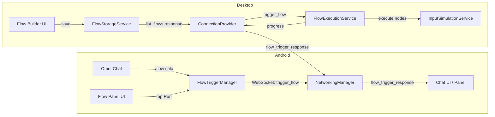

# Phase 3: RPA Flow System — Create on Desktop, Trigger from Android

Phases 1 (Complex Prompt Handling) and 2 (Conversation Memory) are ✅ complete and committed.

This plan covers the full RPA Flow Trigger System: a Desktop flow builder UI where users visually design automation flows using a node graph, persist them to disk, and trigger them from the Android Omni-Chat or a dedicated Flows panel — with real-time progress streaming back to Android.

---

## User Review Required

> [!IMPORTANT]
> This is a large feature spanning **~20 new/modified files across both projects**. I've broken it into 4 sub-phases that can be shipped incrementally. Each sub-phase is independently testable.

> [!WARNING]
> **New WebSocket protocol messages** (`flow_sync`, `trigger_flow`, `flow_trigger_response`, `list_flows`) will be added. The Android app and Desktop agent must be updated together for flow triggering to work, though each side gracefully ignores unknown message types.

## Open Questions

> [!IMPORTANT]
> 1. **Desktop Flow Node Types:** I'm proposing Desktop-native equivalents of the Android nodes: `ClickNode`, `TypeTextNode`, `HotkeyNode`, `LaunchAppNode`, `DelayNode`, `ScreenshotNode`, `RepeatNode`, and `ConditionalNode`. These map to native Windows UIA/pyautogui actions. Should I also include a `BrowserActionNode` (for web tasks routed through the browser agentic loop)?
> 2. **Flow Trigger from Omni-Chat:** I'm proposing a `/flow <name>` slash-command in the Android chat. Should it also be triggerable via natural language (e.g., "run my calculator flow") with LLM intent classification?
> 3. **Flow Sync Direction:** Currently planned as Desktop → Android (Desktop advertises its flows, Android triggers them). Should Android also sync its flows TO Desktop for Desktop-side execution of Android-origin flows?

---

## Architecture Overview



---

## Sub-Phase 3A: Desktop Flow Models & Storage

### Desktop Side

#### [NEW] [desktop_flow_models.dart](file:///f:/Autonion%20Desktop/Autonion-Agent/lib/features/desktop_automation/models/desktop_flow_models.dart)

Desktop-native flow graph model. Parallels Android's `FlowGraph` / `FlowNode` but uses Desktop-native action types:

```dart
/// Top-level flow container (mirrors Android FlowGraph)
class DesktopFlow {
  final String id;
  final String name;
  final String description;
  final int version;
  final List<DesktopFlowNode> nodes;
  final List<DesktopFlowEdge> edges;
  final DateTime createdAt;
  final DateTime updatedAt;
  final List<String> tags;
}

/// Flow node types optimized for Desktop (Windows UIA + pyautogui)
enum DesktopFlowNodeType {
  start,        // Entry point
  click,        // Click at x/y or UIA element (stableId)
  doubleClick,  // Double-click
  rightClick,   // Right-click
  typeText,     // Type text (pyautogui type or UIA SetValue)
  hotkey,       // Keyboard shortcut (e.g. ["ctrl", "s"])
  launchApp,    // Open app via Win+R or Start Menu
  delay,        // Wait for N ms
  screenshot,   // Capture screen
  scroll,       // Scroll direction + amount
  repeat,       // Loop N times
  conditional,  // Branch based on screen state (element exists?)
  done,         // Terminal node
}

/// Sealed class hierarchy for typed node data
abstract class DesktopFlowNode {
  String id;
  DesktopFlowNodeType nodeType;
  String label;
  double x, y;  // Canvas position
  String? onFailureEdgeId;
}

// Concrete: ClickFlowNode, TypeTextFlowNode, HotkeyFlowNode, etc.
// Each carries its specific parameters (coordinates, keys, text...)
```

---

#### [NEW] [flow_storage_service.dart](file:///f:/Autonion%20Desktop/Autonion-Agent/lib/features/desktop_automation/services/flow_storage_service.dart)

File-based persistence for Desktop flows. Stored as JSON in `~/.autonion/flows/`.

```dart
class FlowStorageService {
  /// Directory: ~/.autonion/flows/
  Future<void> saveFlow(DesktopFlow flow);
  Future<DesktopFlow?> loadFlow(String id);
  Future<List<DesktopFlow>> listFlows();
  Future<bool> deleteFlow(String id);
  Future<bool> flowExists(String id);
  
  /// Returns lightweight manifests for sync to Android
  Future<List<FlowManifest>> listFlowManifests();
}

class FlowManifest {
  final String id;
  final String name;
  final String description;
  final int nodeCount;
  final String target; // "desktop"
  final DateTime createdAt;
  final DateTime updatedAt;
  final List<String> tags;
}
```

**Storage format:** One JSON file per flow at `~/.autonion/flows/<flow-id>.json`. The `FlowManifest` is a lightweight subset sent to Android for display in the flow list.

---

### Verification (3A)
- Unit test: create, save, load, list, delete flows via `FlowStorageService`
- Verify JSON round-trip serialization

---

## Sub-Phase 3B: Desktop Flow Execution Engine

#### [NEW] [flow_execution_service.dart](file:///f:/Autonion%20Desktop/Autonion-Agent/lib/features/desktop_automation/services/flow_execution_service.dart)

Executes a `DesktopFlow` step-by-step using the existing `InputSimulationService`:

```dart
class FlowExecutionService {
  final InputSimulationService _input;
  final LoggingService _log;
  
  bool _isRunning = false;
  bool _stopRequested = false;
  
  /// Execute a flow, reporting progress via callback.
  Future<FlowExecutionResult> executeFlow(
    DesktopFlow flow, {
    void Function(FlowStepProgress)? onProgress,
  });
  
  /// Stop the currently running flow.
  void stopFlow();
}

class FlowStepProgress {
  final String flowId;
  final String status;   // "started", "step_executing", "step_completed", "completed", "failed"
  final String message;
  final int currentStep;
  final int totalSteps;
  final String? nodeLabel;
}

class FlowExecutionResult {
  final bool success;
  final int stepsExecuted;
  final String? errorMessage;
  final Duration elapsed;
}
```

**Node-to-action mapping:**

| DesktopFlowNodeType | InputSimulationService action |
|---------------------|-------------------------------|
| `click` | `execute(DesktopAction(type: 'click', x, y))` |
| `typeText` | `execute(DesktopAction(type: 'type', text))` |
| `hotkey` | `execute(DesktopAction(type: 'hotkey', keys))` |
| `launchApp` | `execute(DesktopAction(type: 'hotkey', keys: ['win']))` → `type(appName)` → `enter` |
| `delay` | `Future.delayed(Duration(milliseconds: delayMs))` |
| `screenshot` | `_tryRunDeterministicScreenshotCommand` |
| `scroll` | `execute(DesktopAction(type: 'scroll', direction, amount))` |
| `repeat` | Loop wrapper around child nodes |
| `conditional` | Check UIA tree for element, branch accordingly |

**Graph traversal:** BFS from `StartNode`, following edges. At each node, execute the action, wait for a configurable settle time, then follow the success edge. On failure, follow the failure edge (if any) or stop.

---

#### [MODIFY] [service_locator.dart](file:///f:/Autonion%20Desktop/Autonion-Agent/lib/core/di/service_locator.dart)

Register `FlowStorageService` and `FlowExecutionService` in the DI container.

---

### Verification (3B)
- Create a test flow programmatically (Start → LaunchApp "notepad" → Delay 2s → TypeText "Hello" → Done)
- Execute it and verify Notepad opens and "Hello" is typed

---

## Sub-Phase 3C: WebSocket Protocol & Android Integration

### Desktop Side

#### [MODIFY] [connection_provider.dart](file:///f:/Autonion%20Desktop/Autonion-Agent/lib/features/connection/providers/connection_provider.dart)

Add handlers in `_executeCommand` for new message types:

```dart
// In _executeCommand, add BEFORE the generic prompt handler:

if (command['type'] == 'trigger_flow') {
  await _handleFlowTrigger(command);
  return;
}

if (command['type'] == 'list_flows') {
  await _handleListFlows(command);
  return;
}

if (command['type'] == 'flow_sync') {
  await _handleFlowSync(command);
  return;
}
```

New methods:
- `_handleFlowTrigger(command)` — Looks up flow by ID, executes via `FlowExecutionService`, streams `flow_trigger_response` messages back to Android with step-by-step progress.
- `_handleListFlows(command)` — Returns `FlowManifest` list to Android.
- `_handleFlowSync(command)` — Receives flow manifests from Android (for future Android → Desktop flow sync).
- `_sendFlowResponse(transactionId, flowId, status, message, step, total)` — Parallels `_sendPromptResponse` but with flow-specific fields.

---

### Android Side

#### [NEW] [FlowTriggerProtocol.kt](file:///c:/Users/Guru/AndroidStudioProjects/AutomationCompanion/app/src/main/java/com/autonion/automationcompanion/features/cross_device_automation/domain/FlowTriggerProtocol.kt)

WebSocket protocol data classes for flow management:

```kotlin
// Request: Android → Desktop
data class FlowTriggerRequest(
    val type: String = "trigger_flow",
    val transactionId: String,
    val flowId: String,
    val parameters: Map<String, String> = emptyMap(),
    val source: String = "android"
)

// Request: Android → Desktop
data class FlowListRequest(
    val type: String = "list_flows",
    val transactionId: String,
    val source: String = "android"
)

// Response: Desktop → Android  
data class FlowTriggerResponse(
    val type: String = "flow_trigger_response",
    val transactionId: String,
    val flowId: String,
    val status: String,   // started, in_progress, step_completed, completed, failed
    val message: String = "",
    val currentStep: Int = 0,
    val totalSteps: Int = 0,
    val nodeLabel: String? = null
)

// Response: Desktop → Android
data class FlowListResponse(
    val type: String = "flow_list_response",
    val transactionId: String,
    val flows: List<FlowManifest>
)

data class FlowManifest(
    val id: String,
    val name: String,
    val description: String = "",
    val nodeCount: Int,
    val target: String = "desktop",
    val createdAt: Long,
    val updatedAt: Long,
    val tags: List<String> = emptyList()
)
```

---

#### [NEW] [FlowTriggerManager.kt](file:///c:/Users/Guru/AndroidStudioProjects/AutomationCompanion/app/src/main/java/com/autonion/automationcompanion/features/cross_device_automation/FlowTriggerManager.kt)

Manages flow triggering and syncing between Android and Desktop:

```kotlin
class FlowTriggerManager(
    private val networkingManager: NetworkingManager
) {
    private val _flowListFlow = MutableStateFlow<List<FlowManifest>>(emptyList())
    val flowList: StateFlow<List<FlowManifest>> = _flowListFlow

    private val _flowResponseFlow = MutableSharedFlow<FlowTriggerResponse>(extraBufferCapacity = 16)
    val flowResponseFlow: SharedFlow<FlowTriggerResponse> = _flowResponseFlow

    /// Request Desktop's available flows
    fun requestFlowList(deviceId: String)
    
    /// Trigger a flow on Desktop
    fun triggerFlow(deviceId: String, flowId: String, params: Map<String, String> = emptyMap()): String // returns txnId
    
    /// Called by NetworkingManager when a flow response arrives
    suspend fun onFlowResponse(response: FlowTriggerResponse)
    
    /// Called by NetworkingManager when a flow list response arrives
    suspend fun onFlowListResponse(response: FlowListResponse)
}
```

---

#### [MODIFY] [NetworkingManager.kt](file:///c:/Users/Guru/AndroidStudioProjects/AutomationCompanion/app/src/main/java/com/autonion/automationcompanion/features/cross_device_automation/networking/NetworkingManager.kt)

In `onMessage`, add handling for new message types after the existing `prompt_response` handler:

```kotlin
// After the existing prompt_response / agent_step_result handling:
if (type == "flow_trigger_response") {
    // Parse and emit to flowTriggerManager
    val response = FlowTriggerResponse(...)
    flowTriggerManager?.onFlowResponse(response)
    return
}

if (type == "flow_list_response") {
    val response = FlowListResponse(...)
    flowTriggerManager?.onFlowListResponse(response)
    return
}
```

---

#### [MODIFY] [OmniChatbotViewModel.kt](file:///c:/Users/Guru/AndroidStudioProjects/AutomationCompanion/app/src/main/java/com/autonion/automationcompanion/features/omni_chatbot/OmniChatbotViewModel.kt)

Add `/flow <name>` slash-command handling in `processPrompt`:

```kotlin
// At the top of processPrompt(), before LLM classification:
if (prompt.startsWith("/flow ")) {
    val flowName = prompt.removePrefix("/flow ").trim()
    handleFlowTrigger(flowName)
    return
}
```

New `handleFlowTrigger(name)` method:
1. Find matching flow from `flowTriggerManager.flowList` by name (fuzzy match)
2. Send `FlowTriggerRequest` via `NetworkingManager`
3. Show "▶️ Running flow: X" in chat
4. Collect `FlowTriggerResponse` events and show step progress in chat bubbles (like existing prompt responses)

---

### Verification (3C)
1. Create a flow on Desktop manually (via code or UI)
2. Send `/flow test_flow` from Android Omni-Chat
3. Verify Desktop executes the flow and Android chat shows step-by-step progress
4. Verify `list_flows` returns manifests to Android

---

## Sub-Phase 3D: Desktop Flow Builder UI

#### [NEW] [flow_builder_screen.dart](file:///f:/Autonion%20Desktop/Autonion-Agent/lib/ui/screens/flow_builder_screen.dart)

Production-grade visual flow builder, inspired by n8n/UiPath:

**Core features:**
- **Canvas:** Infinite-scroll canvas with grid background, pan & zoom (via `InteractiveViewer`)
- **Node palette:** Left sidebar with draggable node types (Click, Type, Hotkey, Launch App, Delay, Screenshot, Repeat, Conditional)
- **Node widgets:** Cards showing icon + label + config summary. Click to open config panel
- **Edge drawing:** Click output port → click input port to create edge. Edges rendered as Bézier curves
- **Config panel:** Right sidebar that opens when a node is selected, showing type-specific configuration fields (coordinates, text, keys, app name, delay ms, etc.)
- **Toolbar:** Save, Run, Delete, Undo/Redo, Export JSON
- **Run mode:** Execute the flow from the builder with inline step highlighting

**Visual design:**
- Dark theme with glassmorphic node cards
- Accent color edges with animated flow direction
- Node type icons using Material Icons
- Status indicators (idle/running/success/error) on nodes during execution
- Smooth drag animations

---

#### [NEW] [flow_builder_provider.dart](file:///f:/Autonion%20Desktop/Autonion-Agent/lib/features/desktop_automation/providers/flow_builder_provider.dart)

State management for the flow builder:

```dart
class FlowBuilderProvider extends ChangeNotifier {
  DesktopFlow? _currentFlow;
  String? _selectedNodeId;
  String? _connectingFromNodeId;
  List<DesktopFlow> _undoStack;
  
  // Canvas state
  Offset _panOffset = Offset.zero;
  double _scale = 1.0;
  
  // CRUD operations
  void addNode(DesktopFlowNodeType type, Offset position);
  void removeNode(String nodeId);
  void updateNode(DesktopFlowNode node);
  void addEdge(String fromNodeId, String toNodeId);
  void removeEdge(String edgeId);
  
  // Selection
  void selectNode(String? nodeId);
  void startConnecting(String nodeId);
  
  // Persistence
  Future<void> saveFlow();
  Future<void> loadFlow(String id);
  Future<void> newFlow(String name);
  
  // Execution
  Future<void> runFlow();
  void stopFlow();
}
```

---

#### [NEW] [flow_list_panel.dart](file:///f:/Autonion%20Desktop/Autonion-Agent/lib/ui/screens/flow_list_panel.dart)

A screen/tab showing all saved flows with:
- Flow cards (name, description, node count, last run, tags)
- Create new, Edit, Delete, Run, Duplicate actions
- Search/filter by name or tag

---

#### [MODIFY] [app.dart](file:///f:/Autonion%20Desktop/Autonion-Agent/lib/app.dart) / Navigation

Add "Flows" tab to the Desktop app's navigation (alongside Dashboard, Connections, Automation, Logs, Settings).

---

### Verification (3D)
1. Open the Desktop app → navigate to "Flows" tab
2. Click "New Flow" → name it "Open Notepad and Type Hello"
3. Drag Start → Launch App (notepad) → Delay (2s) → Type Text (Hello World) → Done
4. Connect nodes with edges
5. Click "Run" → verify Notepad opens and "Hello World" is typed
6. Save → verify JSON persists to `~/.autonion/flows/`
7. From Android, send `/flow Open Notepad and Type Hello` → verify execution with progress

---

## Proposed Implementation Order

| Order | Sub-Phase | Scope | Est. Files |
|-------|-----------|-------|------------|
| 1 | **3A** Models & Storage | Desktop only | 2 new |
| 2 | **3B** Execution Engine | Desktop only | 2 new, 1 modify |
| 3 | **3C** Protocol & Android | Both | 4 new, 3 modify |
| 4 | **3D** Flow Builder UI | Desktop only | 3 new, 1 modify |

---

## Verification Plan

### Automated Tests
- `flutter test` — Desktop project builds without errors
- Unit tests for `FlowStorageService` (CRUD operations)
- Unit tests for flow graph traversal logic

### Manual Verification
1. **End-to-end:** Create flow on Desktop → trigger from Android → see progress in chat
2. **Error handling:** Trigger non-existent flow → see "Flow not found" error in chat
3. **Stop flow:** Start a repeating flow → send kill_switch from Android → flow stops
4. **Persistence:** Create flow → restart Desktop app → flow still listed
5. **UI polish:** Flow builder canvas panning, zooming, node dragging all smooth
